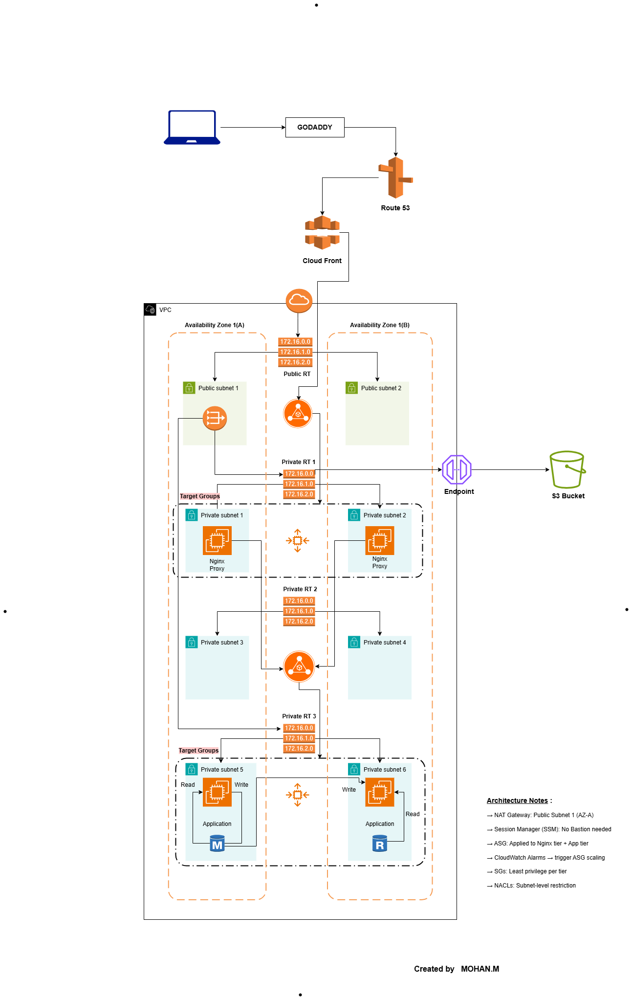

---

# Highly Available 3-Tier Architecture on AWS

This project is part of my hands-on AWS and DevOps learning journey. I built this architecture to understand how real world production infrastructure works on AWS.

---

## Why I Built This

When I started learning AWS, I wanted to go beyond just watching tutorials. I wanted to actually build something that reflects how companies run their applications in the cloud. So I designed and implemented this 3-tier architecture from scratch using core AWS services.

---

## What This Project Does

This is a fully functional highly available 3-tier architecture deployed on AWS. It separates the web layer, application layer, and database layer into different private subnets across two availability zones. The entire setup is containerized, monitored, and automated.

---

## AWS Services Used

| Category | Services |
|---|---|
| Networking | VPC, Subnets, Internet Gateway, NAT Gateway, Route Tables, VPC Endpoint |
| Compute | EC2, Auto Scaling Groups |
| Load Balancing | Application Load Balancer (Internet-Facing + Internal) |
| CDN & DNS | CloudFront, Route 53 |
| Storage | S3 |
| Security | IAM, ACM, Security Groups |
| Monitoring & Alerts | CloudWatch, SNS |
| Application & DB | Docker, Nginx, MariaDB 10.5 |

---

## Architecture Diagram



---

## How Traffic Flows

```
User opens the website
        ↓
GoDaddy resolves the domain
        ↓
Route 53 routes to CloudFront
        ↓
CloudFront delivers content over HTTPS
        ↓
Internet-Facing ALB receives the request
        ↓
Nginx Reverse Proxy (Web Tier) forwards it internally
        ↓
Internal ALB distributes to Application Tier servers
        ↓
Application processes the request
        ↓
MariaDB returns the data
```

---

## Network Design

One custom VPC with two Availability Zones.

| Subnet Type | Count | Purpose |
|---|---|---|
| Public Subnets | 2 | Internet-Facing ALB, NAT Gateway |
| Private Subnets (Web Tier) | 2 | Nginx Reverse Proxy instances |
| Private Subnets (App Tier) | 2 | Dockerized Application + MariaDB |
| Private Subnets (DB routing) | 2 | Internal routing isolation |

Two Availability Zones ensure that if one zone goes down, the application continues running from the other zone.

---

## Security Design

No EC2 instance is directly exposed to the internet. Security is enforced through 5-layer Security Group chaining:

| Layer | Accepts Traffic From |
|---|---|
| Internet-Facing ALB | Internet (HTTPS only) |
| Web Tier (Nginx) | Internet-Facing ALB only |
| Internal ALB | Web Tier only |
| Application Tier | Internal ALB only |
| Database (MariaDB) | Application Tier only |

Every layer communicates only with the layer directly above or below it. Nothing else.

IAM Roles were attached to all EC2 instances to eliminate hardcoded credentials and enforce least-privilege access per tier.

---

## Web Tier

- Nginx configured as a Reverse Proxy
- Deployed inside Private Subnets across both Availability Zones
- Auto Scaling Group configured with ALB Request Count per Target threshold of 50 requests
- Health checks configured on Load Balancer Target Group
- CloudWatch alarm triggers scaling events automatically

---

## Application Tier

- Application containerized and deployed using Docker
- MariaDB 10.5 installed locally on the Application Tier instance
- Deployed inside Private Subnets across both Availability Zones
- Auto Scaling Group configured with CPU utilization threshold of 50 percent
- Design decision: MariaDB installed locally to eliminate RDS cost for this portfolio project. In a production environment, Amazon RDS with Multi-AZ deployment would be used for managed failover and automated backups.

---

## HTTPS and Domain Setup

- Domain registered on GoDaddy
- DNS managed through Route 53 with alias records pointing to CloudFront
- CloudFront configured for global content delivery with HTTPS enforcement
- ACM certificate created in us-east-1 (North Virginia) for CloudFront
- Separate ACM certificate created in ap-south-1 for the Internet-Facing ALB
- End-to-end HTTPS encryption enabled across all layers

---

## Monitoring and Alerts

- CloudWatch monitors ALB Request Count per Target on the Web Tier
- CloudWatch monitors CPU utilization on the Application Tier
- Auto Scaling triggers when Request Count per Target crosses 50 requests (Web Tier)
- Auto Scaling triggers when CPU utilization crosses 50 percent (Application Tier)
- SNS sends email notifications for every scaling event including instance launch and termination

---

## Log Management

- Nginx access.log and error.log collected from Web Tier instances
- Shell script written to compress logs with timestamp and upload to S3
- Crontab configured to run the script automatically every day at 6 PM
- Gateway VPC Endpoint created so logs travel to S3 through the AWS private network without going through NAT Gateway — eliminating NAT data transfer charges for log uploads

---

## Cost Optimizations Applied

| Optimization | Impact |
|---|---|
| Single NAT Gateway instead of two | Reduced hourly NAT Gateway cost by 50% |
| Gateway VPC Endpoint for S3 | Eliminated NAT data transfer charges for log uploads |
| CloudFront caching | Reduced origin EC2 request load |
| Local MariaDB instead of RDS | Avoided managed database instance cost |

---

## Challenges and Resolutions

### 1. Security Group Misconfiguration Blocking Inter-Tier Traffic

**Issue:** Application Tier instances were not receiving traffic from the Web Tier after initial deployment. Health checks were failing on the Internal ALB.

**Root Cause:** Security Group rules on the Internal ALB and Application Tier were referencing incorrect source Security Group IDs. The Web Tier Security Group ID was not correctly chained to the Internal ALB inbound rule.

**Fix:** Corrected the Security Group chaining by explicitly referencing each tier's Security Group ID as the source in the next tier's inbound rule — instead of using CIDR ranges. Verified end-to-end connectivity by testing each hop independently before full traffic flow.

---

### 2. Nginx Reverse Proxy Forwarding Error (502 Bad Gateway)

**Issue:** Nginx on the Web Tier was returning 502 Bad Gateway when forwarding requests to the Internal ALB.

**Root Cause:** The Nginx `proxy_pass` directive was configured with the wrong Internal ALB DNS name format. Additionally, the `proxy_set_header Host` was not set correctly, causing the Internal ALB to reject the forwarded request.

**Fix:** Updated the Nginx configuration with the correct Internal ALB DNS name and added the required proxy headers (`proxy_set_header Host`, `proxy_set_header X-Real-IP`, `proxy_set_header X-Forwarded-For`). Reloaded Nginx configuration and verified 200 responses end-to-end.

---

### 3. Private Subnet S3 Connectivity Failure

**Issue:** Shell script running on Web Tier EC2 instances was failing to upload compressed Nginx logs to S3. Traffic was being routed through the NAT Gateway but uploads were timing out.

**Root Cause:** No direct S3 routing path existed from the private subnets. All S3 traffic was going through the NAT Gateway, which was causing both cost overhead and intermittent timeout failures under load.

**Fix:** Created a Gateway VPC Endpoint for S3 and added a route in the private subnet route tables pointing S3-destined traffic to the VPC Endpoint. This routed S3 traffic through the AWS private network, eliminated NAT Gateway charges for S3 access, and resolved the timeout issue permanently.

---

## What I Learned From This Project

- How to design a real multi-tier VPC network from scratch
- How security group chaining works in practice across 5 layers
- How Auto Scaling and Load Balancers work together for high availability
- How to set up end-to-end HTTPS using CloudFront and ACM across two regions
- How to automate operational tasks using shell scripting and crontab
- How VPC Endpoints reduce cost and improve security for private subnet workloads
- How to think about production readiness, cost optimization, and failure isolation

---

## Project Status

Completed. Infrastructure was tested and verified end-to-end. Resources deleted after project completion to avoid unnecessary AWS charges.

---

## Author

**Mohan M**

AWS & DevOps Engineer

---
